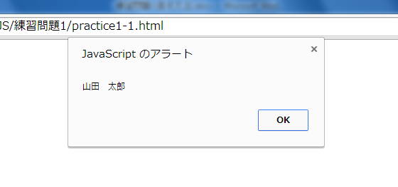
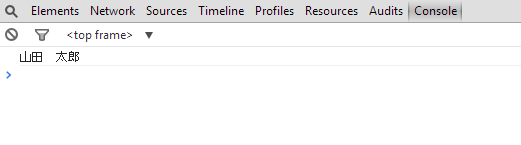
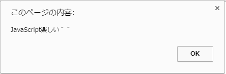
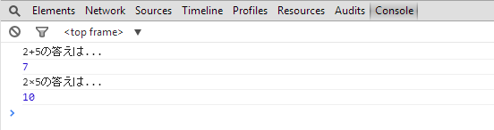
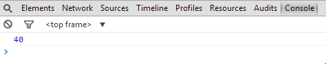
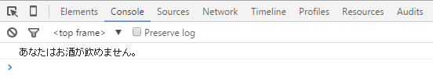
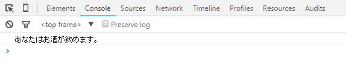
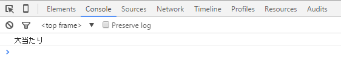
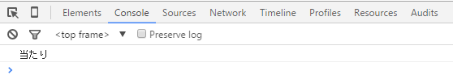
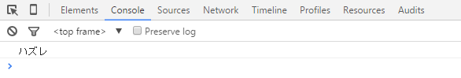

## JavaScript 課題演習１-１

**画面表示に関する課題演習**

- JavaScript の alert 文を使用し、自分の名前をダイアログボックス上に表示してください。
- その際、JavaScript コードは HTML ファイル内に直接記述してください。
- ファイル名は practice1-1.html で作成してください。

**実行結果の例**<br>


<details>
<summary>ヒントを見る</summary>
教科書のアラートを表示する構文を参考に
してください。(P.48)<br>
アラートの命令を実行させる際、scriptタグを
忘れずに記述してください。
</details>

## JavaScript 課題演習１-２

**画面表示に関する課題演習**

- JavaScript の console.log を使用し、自分の名前をコンソール画面に表示させてください。
- ファイル名は practice1-2.html で作成してください。

**実行結果の例**<br>


<details>
<summary>ヒントを見る</summary>
教科書のコンソールログを表示する構文を参考にしてください。<br>
F12キーでコンソール画面を表示できます。
</details>

## JavaScript 課題演習１-３

**ファイル読み込みに関する課題演習**

- 以下の JavaScript コードをコピーしてください。

```
 alert("JavaScript楽しい＾＾");
```

- 新規で sample.js ファイルを作成した後、コピーしたコードを
  貼り付けてください。
- practice1-3.html を作成し、sample.js ファイルを読み込ませるコードを記述後、結果を Web で確認してください。

**実行結果の例**<br>


<details>
<summary>ヒントを見る</summary>
scriptタグにファイルを読み込ませるコードを書きます。<br>
CSSファイルの読み込みと同様に相対パスを使用します。
</details>

## JavaScript 課題演習１-４

**バグ(不具合)を修正する課題演習**

- practice1-4.html を作成し、以下のコードをコピー＆ペーストしてください。

```html
<!DOCTYPE html>
<html lang="ja">
  <head>
    <meta charset="UTF-8" />
    <title>Document</title>
  </head>
  <body>
    <script>
      "use strict";

      // 変数の宣言
      let a = 2;
      let b = 5;
      const c = 0;

      // 2+5の計算式
      c = a + b;
      console.log("2+5の答えは...");
      console.log(c);

      // 2×5の計算式
      c = a * b;
      console.log("2×5の答えは...");
      console.log(c);
    </script>
  </body>
</html>
```

- プログラムにはバグ（誤り）がいくつか存在します。<br>バグを修正し、実行結果の写真と同じになるようにしてください。

**実行結果の例**<br>


<details>
<summary>ヒントを見る</summary>
変数の宣言、単語のスペル、構文のルールを確認しながらバグを修正してください。<br>
変数の宣言であるconstとletの違いに注目しながら修正してみてください。
</details>

## JavaScript 課題演習１-５

**変数と演算に関する課題演習**

- 底辺と高さの値を格納する変数（変数名は任意）を用意して、三角形の面積を求めるプログラムを作成してください。
- 結果はコンソール画面に出力させてください。<br>底辺、高さの値は任意とします。
- ファイル名は practice1-5.html

<mark>三角形の面積の求め方：底辺 × 高さ ÷2</mark>

**実行結果の例**<br>


<details>
<summary>ヒントを見る</summary>
三角形の面積=底辺×高さ÷2の式をプログラムに置き換えていきます。<br>
×は*(アスタリスク)<br>
÷は/(スラッシュ)<br>
問題文にある通り、必ず変数を用いて計算させてください。
</details>

## JavaScript 課題演習１-６

**条件分岐に関する課題演習**

- 変数 age を用意してください。
- 変数 age の中の数値が、20(歳)以上なら「あなたはお酒が飲めます。」
  20 歳未満なら「あなたはお酒が飲めません。」という条件分岐を記述してみましょう。
- 結果はコンソール画面に出力してください。
- ファイル名は、practice1-6.html

**実行結果の例（20 歳未満の時）**<br>


**実行結果の例（20 歳以上の時）**<br>


<details>
<summary>ヒントを見る</summary>
その時の状況に応じて出力内容を変えたい時は、条件分岐文を使います。
今回はif~else文で試してみてください。

if~else 文の例

```js
if (条件式) {
  条件式の結果がtrueの時;
} else {
  条件式の結果がfalseの時;
}
```

※条件式の設定に気をつけてください。<br>
＜=　・・・　以下<br>
＞=・・・・以上<br>
＜ ・・・より小さい<br>
＞　・・・より大きい

</details>

## JavaScript 課題演習１-７

**条件分岐に関する課題演習**

- 変数 chuusen を用意して下さい。<br>
  変数内のデータが 7 と等しいなら「大当たり」<br>
  3 と等しいなら「当たり」<br>
  それ以外は「ハズレ」<br>
  という条件分岐を記述してみましょう。
- 結果はコンソール画面に出力してください。
- ファイル名は、practice1-7.html

**実行結果の例**<br>
**変数 chuusen の値が 7 の時**<br>


**変数 chuusen の値が 3 の時**<br>


**変数 chuusen の値が 7 と 3 以外の時**<br>


<details>
<summary>ヒントを見る</summary>
条件を複数設定したい場合<br>
「多方向分岐」を使うと実現できます。<br>
if～else文、switch文どちらでもできます。<br>

(複数の条件を指定したい時)<br>

```js
if～else if文

if( 条件式1 ){
		条件式1の結果がtrueの時
}else if( 条件式2 ){
		条件式2の結果がfalseの時
} else if( 条件式 ３){
		条件式3の結果がfalseの時
}else{
		条件式１,2,3のどれにも当てはまらない時
}

※else文は省略することもできます。
```

</details>

## JavaScript 課題演習１-８

**画面表示に関する課題演習**

- 上記７.の問題をアレンジしましょう。
- 変数 chuusen にはランダムで 0~9 までの数値を入れ<br>
  変数内のデータが 7 と等しいなら「大当たり」<br>
  3 と等しいなら「当たり」<br>
  それ以外は「ハズレ」<br>
  という条件分岐を記述してみましょう。
- 結果はコンソール画面（ドキュメント上でも OK）に出力してください。
- ファイル名は、practice1-8.html

**実行結果の例**<br>
**変数 chuusen の値が 7 の時**<br>


**変数 chuusen の値が 3 の時**<br>


**変数 chuusen の値が 7 と 3 以外の時**<br>


<details>
<summary>ヒントを見る</summary>
ランダムな数字を出すメソッドはP.83を参照。<br>

ドキュメント上に出力したい場合<br>
手順<br>
①P 要素や div 要素を作成し、そこに適当な id を振る<br>
②document.getElementById 等を利用し、p 要素や div 要素を取得する<br>
③ その要素の textContent というプロパティに chuusen を代入する

</details>
