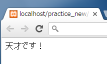
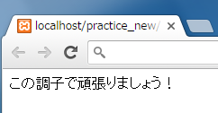
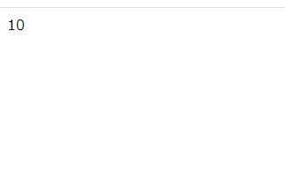
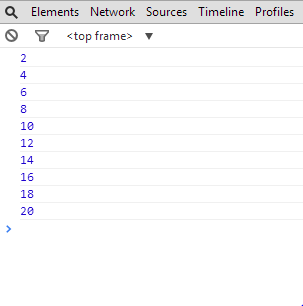
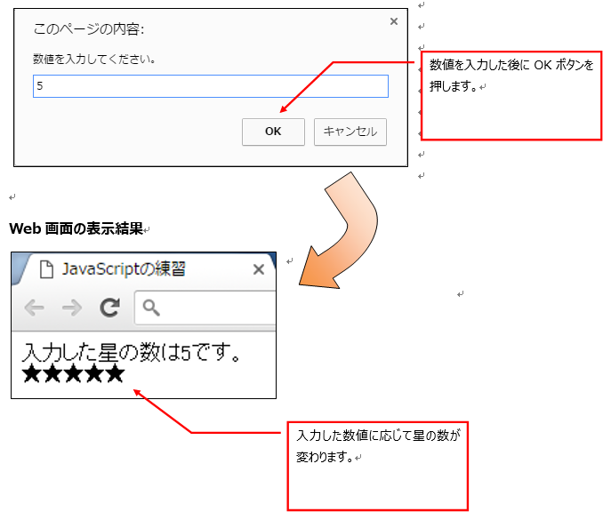
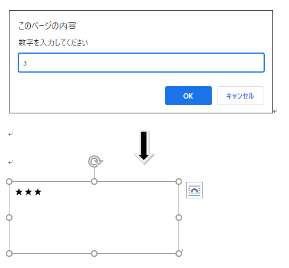
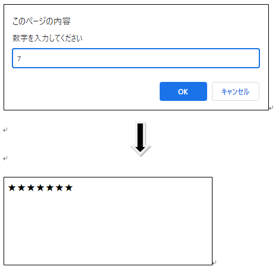

## JavaScript 課題演習２-１

**論理演算子の課題演習**

- 定数 score を用意して、テストの点数に応じて出力するメッセージを変化させる条件分岐を記述してみましょう。
- document.write() という使用して、Web 画面上に出力。
  > document.write メソッドは()内のパラメータをブラウザ上に表示するメソッドです。
- ファイル名は practice2-1.html

テストの点数が 0 点〰30 点の場合「赤点です！」<br>
テストの点数が 31 点〰59 点の場合「もっと勉強しましょう！」<br>
テストの点数が 60 点〰79 点の場合「80 点以上目指して頑張りましょう！」<br>
テストの点数が 80 点〰90 点の場合「この調子で頑張りましょう！」<br>
テストの点数が 91 点〰99 点の場合「すばらしい！」<br>
テストの点数が 100 点の場合「天才です！」

**実行結果の例**<br>
| 100 を設定した場合 | 80 を設定した場合 |
|----|----|
|  |  |

<details>
<summary>ヒントを見る</summary>
論理演算子を使うと実現できます。<br>
｢&&｣(左式と右式どちらもtrue）<br>
｢||｣(左式と右式どちらかがtrue）<br>
から必要な方を使います。<br>
<br>

例 1

```js
if (a > b && c === d) {
  trueのときの記述;
}
```

a が b より大きい<mark>かつ</mark>c と d が等しい<br>
（左式「a > b」と右式「c === d」どちらも正しいときだけ true）

```js
if(a > b || c === d)｛trueのときの記述｝
```

a が b より大きい<mark>または</mark>c と d が等しい<br>
（左式「a > b」と右式「c === d」どちらか１つでも正しければ true）

</details>

## JavaScript 課題演習２-２

**繰り返し処理の課題演習**

- while 文を使用して、1 を 10 回足した結果をコンソールに出力するプログラムを作成してください。
- ファイル名は、practice2-2.html

**実行結果の例**<br>


<details>
<summary>ヒントを見る</summary>
以下の書式で考えてみてください。<br>
初期化式...繰り返しを数えるための変数と、最初の値(何の数字から数え始めるか)を設定<br>
条件式...繰り返しを続けるための条件を設定（条件に当てはまればもう一度{}の中を処理する）<br>
増減式...数えている変数の値を増減させる式<br>
<br>

書式

```js
let 初期化式;
while (条件式) {
  処理文;
  増減式;
}
```

例：0 から始めて 5 回繰り返しを行う

```js
let i = 0;
while (i < 5) {
  処理文;
  i += 1;
}
```

結果的に繰り返しは 5 回行われます。(01234 の 5 回)<br>
while の条件が「<=」になると i が 5 のときも繰り返しが行われるので、6 回になります。

</details>

## JavaScript 課題演習２-３

**繰り返し処理の課題演習**

- while 文を使用して 2、4、6、8、10・・・20 までの偶数のみを出力するプログラムを作成してください。
- 結果は console.log を使用し、コンソール画面に出力してください。
- ※実現方法は１つだけではありませんので、興味のある方は探してみてください。
- ファイル名は、practice2-3.html

**実行結果の例**<br>


<details>
<summary>ヒントを見る</summary>
書式は2-2と同じです。<br>
増減式を考える必要があります。

例：0 から始めて 5 ずつ増やす
（10 超えるまで続ける）

```js
let i = 0;
while (i <= 10) {
  処理文;
  i += 5;
}
```

※3 回繰り返される<br>
増減値の増加量は条件式が最終的に false になるならどういう増やし方をしても OK です。（何なら減らしても OK です）

</details>

## (サンプル)prompt 関数を用いた Web アプリケーション

※以下のコードは次の問題のヒントになります。<br>

- 以下のプログラムで html を作成し、実行してみてください。
- 動きが理解できたら、次の問題に取り組んでみてください。
- ファイル名：promptSample.html で保存してください。

```html
<!DOCTYPE html>
<html lang="ja">
  <head>
    <meta charset="UTF-8" />
    <title>JavaScriptの練習</title>
  </head>
  <body>
    <!-- このp要素に★を表示 -->
    <p id="result"></p>
    <script>
      "use strict";

      // プロンプトを利用してデータを変数number代入
      const number = parseInt(prompt("数値を入力してください"));

      // ★をブラウザ上に表示
      let i = 1;
      while (i <= number) {
        //要素の中のテキストを上書きせず、後ろに★を追加
        document.getElementById("result").textContent += "★";
        i += 1;
      }
    </script>
  </body>
</html>
```

**実行結果の例**<br>


## JavaScript 課題演習２-４

**繰り返し処理と条件分岐の課題演習**

- 上のサンプル「promptSample.html」をアレンジして挑戦してみてください。
- prompt 画面で入力した数字が「3」「7」のときだけ、その数の分 ★ を繰り返し出力するプログラムを while 文と if 文（論理演算子を用いる）で作成しなさい。
- ファイル名：practice2-4.html

1. プロンプト画面に数字を入力させる
2. if 文は必ず論理演算子を使う
3. 「3」の場合 while()を使って 3 回「★」<br>「7」の場合 while()を使って 7 回「★」<br>をブラウザ上に表示。それ以外は非表示。

**実行結果の例(入力した数字が 3 のとき)**<br>


**実行結果の例(入力した数字が 7 のとき)**<br>


※上記以外の数値が入力された時は何も出力しないこと。

<details>
<summary>ヒントを見る</summary>
どの位置にifを加えるか、ifの条件式をどうするかが重要です。<br>
ifを加える場所…処理の流れを見て、★を出力する処理の部分だけをifのブロックで囲ってみましょう。<br>
ifの条件式...今回処理をするときはどんなときでしょうか。「どれ」が、「何」の値のときか考えてみましょう。<br>
２つ以上条件があるときは論理演算子(問題2-1)を思い出してください。

</details>
