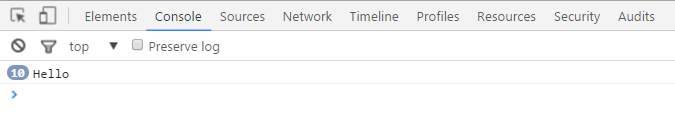
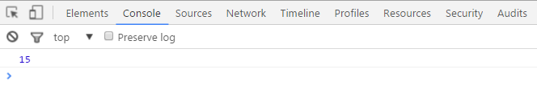
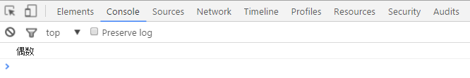
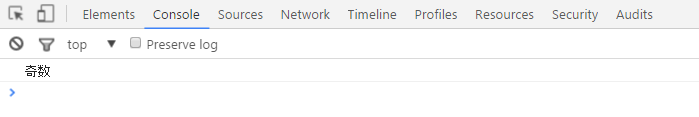
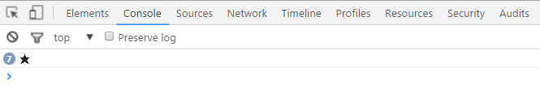
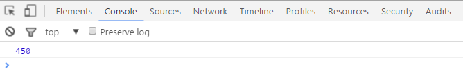

## JavaScript 課題演習３-１

**自作関数に関する課題演習**

- Hello と１０回表示する自作関数を作成してください。<br>
  ※引数は無しで作成してください。<br>
  ※ファンクションで作られていれば処理内容は問いません。
- 結果はコンソール画面に出力させてください。
- ファイル名：practice3-1.html

**実行結果の例**<br>


<details>
<summary>ヒントを見る</summary>
※関数の処理手順<br>
自作関数(ファンクション)の用意<br>
　　　　　　　　↓<br>
自作関数(ファンクション)の呼び出し<br>

例：

```js
//関数の用意
function sample() {
  処理する内容;
}

//関数の実行
sample();
```

※関数の定義と関数の呼び出しはどちらからコードを書き始めても構いません。

</details>

## JavaScript 課題演習３-２

**自作関数に関する課題演習**

- 引数を２つ持ち、掛け算をする自作関数を作成してください。
- 計算結果は return 文を使用し、呼び出し元に計算結果を戻してからコンソール画面で表示させてください。
- ファイル名：practice3-2.html

**実行結果の例(3x5 の場合)**<br>


<details>
<summary>ヒントを見る</summary>
例　引数を２つ用意する例

```js
//関数の定義
function test(引数を受け取る変数1, 引数を受け取る変数2) {
  計算処理;
  return 戻り値;
}

//test関数の呼び出し(戻り値が来ているかconsole.logで確認)
console.log(test(関数に送る引数1, 関数に送る引数2));
```

関数を呼び出せば return されてくる値が呼び出した場所に返る。<br>
例えば「return 5」なら「test(関数に送る引数)」の部分が「5」になります。

</details>

## JavaScript 課題演習３-３

**自作関数に関する課題演習**

- 引数を１つ用意し、その値が偶数、奇数を判定する自作関数を作成してください。※return 文は無し。
- 結果はコンソール画面に出力させてください。
- ファイル名：practice3-3.html

**実行結果の例(偶数の場合)**<br>


**実行結果の例(奇数の場合)**<br>


<details>
<summary>ヒントを見る</summary>
自作した関数の中に偶数、奇数判定の処理が入ります。<br>
偶数か奇数を求めるときは余りを使います。

```js
if (引数の値が偶数か奇数の判定) {
  //偶数の時の出力
} else {
  //奇数の時の出力
}
```

fizzbuzz のような判定方法が必要になります。(P.119)

</details>

## JavaScript 課題演習３-４

**自作関数に関する課題演習**

- 引数で指定した数値の数だけ、★ を出力する自作関数を作成してください。※return 文は無し。
- 結果はコンソール画面に出力させてください。
- ファイル名：practice3-4.html

**実行結果の例(引数が 7 の場合)**<br>


<details>
<summary>ヒントを見る</summary>
引数に数値をセットさせてください。<br>
引数で受け取った数値の数だけ★を繰り返し表示させます。<br>

1. 関数の定義
2. 関数の呼び出し
3. 引数に入っている数値の数だけ ★ を繰り返しコンソールに出力させます。

</details>

## JavaScript 課題演習３-５

**自作関数に関する課題演習**

- 台形の面積を求める自作関数を作成してください。
- ファイル名：practice3-5.html

1. 関数の呼び出し側で引数を３つ用意してください。（値は全て整数）
2. ３つの値を自分で定義した自作関数の引数に渡し、台形の面積を求める計算をさせて下さい。
3. 計算結果を戻り値として呼び出し元に戻し、コンソール画面に出力させてください。

<mark>台形の面積：（上底＋下底）× 　高さ ÷ ２</mark>

**実行結果の例(上底 10,下底 20,高さ 30 の時)**<br>


<details>
<summary>ヒントを見る</summary>
台形の面積をコードになおしていきます。<br>
呼び出し側の引数がポイントです。<br>

```js
function sample(a, b, c) {
  台形の面積を求めるプログラム;
}
```

</details>
