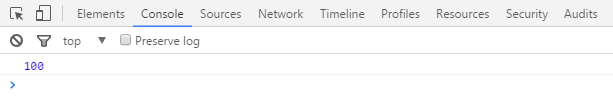
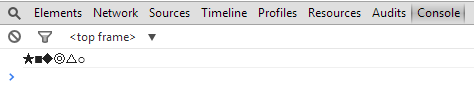
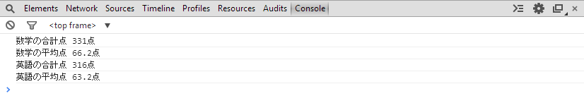
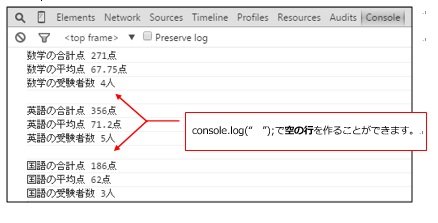
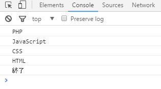
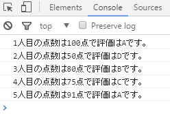

## JavaScript 課題演習４-１

**配列内のデータを取り出すための課題演習**

- 以下の配列が用意されているとします。<br>
  この配列内の数値データを全て加算させ、コンソール画面に出力するように作成してください。
- ファイル名は practice4-1.html

```js
let data = [10, 20, 30, 40];
```

**実行結果の例**<br>


<details>
<summary>ヒントを見る</summary>
「要素の参照」の理屈が分かると、実行結果と同じ表示ができます。<br>
<br>
手順<br>

1. 配列の各要素内のデータの添字(インデック番号)を指定して取り出す。
2. 取り出したデータを加算
3. コンソール画面で出力

</details>

## JavaScript 課題演習４-２

**配列内のデータを取り出すための課題演習**

- 以下の配列が用意されているとします。<br>
  この配列を使用し、以下の実行結果と同じになるようにプログラムを作成してください。
- ファイル名は practice4-2.html

```js
let data = ["★", "○", "■", "△", "◆", "◎"];
```

**実行結果の例**<br>


<details>
<summary>ヒントを見る</summary>
「要素の参照」を取り出す順番を変えて行いましょう。<br>
一気に取り出さず、１つずつ出力すると良いです。
</details>

## JavaScript 課題演習４-３

**配列内のデータを取り出すための課題演習**

- practice4-3.html を作成し、以下のコードをコピー＆ペーストで貼り付けてください。
- 以下のプログラム内の二次元配列 data から「Python」を取得し、コンソールに表示してください。

```js
<script>
    'use strict'; 
    
    const data = [
     ['JavaScript', 'PHP', 'Python'],
     ['MySQL','PostgreSQL', 'SQLite'],
     ['Windows', 'Mac', 'Linux'],
    ];
</script>
```

<details>
<summary>ヒントを見る</summary>
二次元配列の中から指定したデータを取得したい場合は２つ添字(インデック番号)を指定する必要があります。<br>
まずは大きい箱の何個目から取り出したいか考えてから、中の要素のどれが欲しいか考えてみましょう。<br>
例：上記二次元配列dataからJavaScriptを取り出す…data[0][0]

</details>

## JavaScript 課題演習４-４

**配列内データ同士の計算　課題演習**

- 以下の表はあるクラスの数学と英語の点数を管理している表です。
- 各教科の合計点及び平均点を計算しようと考えています。
- JavaScriptの二次元配列を使用し、数学及び英語の各教科の合計点、平均点を求めてください。
- ファイル名はpractice4-4.html

点数管理表
|数学|英語|
|---|---|
|75|80|
|55|60|
|91|71|
|50|45|
|60|60|

**実行結果の例**<br>


<details>
<summary>ヒントを見る</summary>

二次元配列の中から指定したデータを取得した後に演算処理をさせます。

1. 二次元配列を用意し、数学と英語の各教科の点数を持たせます。
2. 各科目の合計点の計算及び平均点を求めていきます。

例:数学と英語の点数を持つ配列を作成
```js
let score = [
  [数学の点数１,数学の点数２],
  [英語の点数１,英語の点数２]
];
```

</details>

## JavaScript 課題演習４-５

**配列内データ同士の計算　課題演習**

- 以下の表はあるクラスの数学と英語と国語の点数を管理している表です。
- JavaScriptの二次元配列を使用し、各教科の合計点、平均点、科目ごとの受験者数を求めてください。<br>
※科目ごとの受験者数は配列で用意されている機能を用いて求めることができます。
- ファイル名はpractice4-5.html


点数管理表
|数学|英語|国語|
|:---:|:---:|:---:|
|75|80|53|
|55|60|55|
|91|71|78|
|50|45|／|
|／|60|／|

**実行結果の例**<br>


<details>
<summary>ヒントを見る</summary>
二次元配列の要素数は全てが揃っている必要はありません。

例：異なる要素数を持つ二次元配列
```js
let a = [ 
  [1,2,3] ,
  [4,5,6,7],
  [8,9,10,11,12]
];
```

- 科目ごとの受験者数の求め方<br>
一次元配列で要素数を求める場合は.lengthメソッドで求めることができます

```js
//例：一次元配列の要素数を求めるプログラム
let number = [10,20,30];

//一次元配列numberの要素数を求める
console.log(number.length);
```

上記の考え方を二次元配列でも使うことができます。(ただしコードを少し変更することになります)
</details>

## JavaScript 課題演習４-６

**配列＋繰り返し文に関する課題演習**

- 以下の配列を使用して、実行結果の写真と同じ結果を出力するプログラムを作成してください。
- 必ず繰り返し文とセットで作成してください。
- ファイル名は、practice4-6.html

```js
const lang = [ "HTML" , "CSS" , "JavaScript" , "PHP" ];
```

**実行結果の例**<br>


<details>
<summary>ヒントを見る</summary>
配列と繰り返し文の組み合わせになります。

繰り返しのカウント変数を利用して、配列を後ろから数えさせることで後ろから取得することができます。<br>
まずは繰り返しを作成して、カウントを増やすのではなく減らして止まるようにしてみましょう。

</details>

## JavaScript 課題演習４-７

**配列＋繰り返し文に関する課題演習**

- 以下の配列を使用して実行結果の写真と同じ結果を出力するプログラムを作成してください。
- ※配列内に保管されているテストの点数を繰り返し文で取り出し、点数に応じてA～Dまでの評価に分類させるようにして下さい。
- ファイル名は、practice4-7.html

使用する配列
```js
const score = [ 100, 50, 80, 75, 91 ];
```

点数と評価の一覧
```
100～90点まではA評価
 89～80点まではB評価
 79～70点まではC評価
 69～ 0点まではD評価
```

**実行結果の例**<br>


<details>
<summary>ヒントを見る</summary>
配列と繰り返し文の組み合わせになります。<br>
for文を使って作ることができます。

『作成のポイント』
1. 繰り返し文を作成(配列の要素数だけ繰り返す)
2. 点数に応じてA～D評価に振り分けする分岐処理を繰り返し文の中に作る。
(○○点～△△点までは、論理演算子を使用して、表現することができます。)

例：90点以上、100点以下<br>
　|----------------|<br>
90点　　　　　100点

3. コンソール画面に出力するプログラムを作成<br>
※○人目の点数は××点で評価は△です。<br>
　↑○の部分に注意してください。<br>
作り込みに不備があると人数の表示がおかしくなります。

※その１～その３を１つずつ確実に作りましょう。

ダメな例<br>
　『０人目の点数は100点で～』<br>
　『１人目の点数は50点で～』<br>
　『２人目の点数は80点で～』<br>
　『３人目の点数は75点で～』<br>
　『４人目の点数は91点で～』

</details>