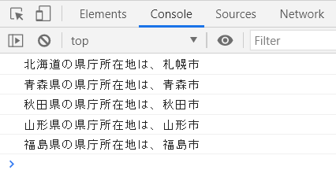
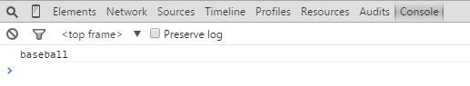
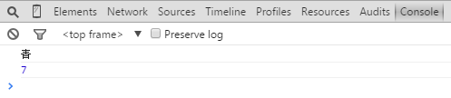
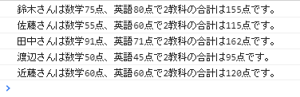
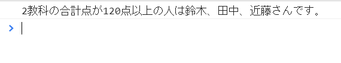

## JavaScript 課題演習５-１

**連想配列に関する課題演習**
- 都道府県を管理する連想配列（オブジェクト）を作成し、コンソール画面に県庁所在地を出力させてください。<br>
※都道府県名をキー（プロパティ名）にして、値（データ）は県庁所在地にしてください。<br>
※表示させるデータは５つ程で構いません。
- ファイル名はpractice5-1.html

都道府県名：北海道、青森県、秋田県、山形県、福島県<br>
県庁所在地：札幌市、青森市、秋田市、山形市、福島市<br>


**実行結果の例**<br>


<details>
<summary>ヒントを見る</summary>
連想配列の書き方と取り出し方<br>

```js
//半角アルファベットをキーにした場合
let data = {
	food:"カレー",
	color:"赤"
}

//カレーを取り出して出力
console.log(data["food"]); 
//もしくは
console.log(data.food); 
```
=======================
```js
//全角文字をキーにした場合
let data = {
	"食べ物":"カレー",
	"色":"赤"
}
//カレーを取り出して出力
console.log(data["食べ物"]);
```
まずは各都道府県と県庁所在地をそれぞれキーと値のセットにしてオブジェクトを作成しましょう。
</details>

## JavaScript 課題演習５-２

**連想配列＋繰り返し文に関する課題演習**
- 以下の連想配列のデータの中から「baseball」だけをコンソール画面に出力するプログラムを作成してください。※for-in文を必ず使用して下さい。
- ファイル名は、practice5-2.html

```js
const favorites = { 
    food : "カレーライス",
    color : "青",
    number : 7,
    sports : "baseball"
};
```

プログラムの考え方(for-in文と条件分岐を組み合わせる)
|繰り返し文|+|条件分岐文|
|---|---|---|
|```for(let 変数 in オブジェクト名){}```|+|```if(条件式){//baseballの文字が出力される処理}```|

**実行結果の例**<br>


<details>
<summary>ヒントを見る</summary>

繰り返し文(for-in文)と条件分岐の組み合わせプログラムになります。<br>
for-in文で取り出した連想配列内のデータをif文で比較する発想ができると解くことができます。<br>
<br>
例 条件判定の例<br>

```js
if(連想配列から取出したもの === 取り出したいもの){
    //取り出したものの値を出力
}
```
for-in文で取り出されるのが何なのか考えてみましょう。

</details>

## JavaScript 課題演習５-３

**連想配列＋繰り返し制御文に関する課題演習**
- 問題2の連想配列を引き続き使います。
- for-in文で連想配列内の値をコンソール画面に出力させます。
- 今度は「青」と「7」だけ、コンソール画面に出力するプログラムを作成してください。
- ファイル名は、practice5-3.html


**実行結果の例**<br>


<details>
<summary>ヒントを見る</summary>
5-2のif条件式をどのように設定するのかがポイントです。

正解の書き方は複数あります。<br>

1. 論理演算子を用いた書き方
2. if~elseif文を用いた書き方

どちらを選択しても同じ実行結果にすることができます。

</details>


## JavaScript 課題演習５-４

**連想配列＋繰り返し文に関する課題演習**
- 点数管理表をもとに連想配列を作成し、for-inを使って実行結果のようにコンソール画面に出力されるようプログラムを作成してください。
- ただし、文字の出力は<mark>テンプレート文字列</mark>を使用すること。
- ファイル名は、practice5-4.html

点数管理表
||数学|英語|
|:---:|:---:|:---:|
|鈴木|75|80|
|佐藤|55|60|
|田中|91|71|
|渡辺|50|45|
|近藤|60|60|

**実行結果の例**<br>


<details>
<summary>ヒントを見る</summary>
連想配列の中の値を配列形式にセットすることも
可能です。

```js
let data = {
    color : ['red', 'blue', 'green'] ,
    size : ['small','midium','large'],
}
```


\`(バッククォート)の中の変数は展開します。(テキストP.131参考)

```js
let num = 5;
`数字は${num}です。`→数字は５です。
```

</details>

## JavaScript 課題演習５-５

**連想配列＋繰り返し文に関する課題演習**
- 問題4の連想配列を引き続き使います。
- 2教科の合計点が120点以上の人の名前を出力するプログラムを作成してください。<br>
※下記のメソッドを使って該当の名前を空の配列に入れていくとよいです。
- ファイル名は、practice5-5.html

配列に要素を追加するときはpush()メソッドを使います。<br>
書式：配列名.push('要素');

配列の要素を指定した区切り文字で連結する場合join()メソッドを使います。<br>
書式：配列名.join('区切り文字'); ' or “で括る


**実行結果の例**<br>


<details>
<summary>ヒントを見る</summary>

まずは５-２、３辺りを参考にifで該当する人物かどうか条件式に当てはめていきます。<br>
当てはまる人物を空の配列にpushしていくイメージです。

push()メソッドは配列の最後に要素を追加します。

```js
let array = [10, 20, 30];
array.push(40);
console.log(array);  //⇒ [10, 20, 30, 40]
```

join()メソッドは区切り文字で配列の要素をひとつの
文字列にします。

```js
let array = ['I', 'like', 'JavaScript.'];
let join = array.join(' ');//くっつけるときの間の区切り文字は半角スペース
console.log(join);  //⇒　I like JavaScript.
```

</details>
