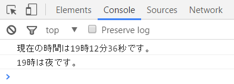
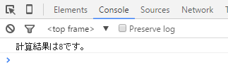
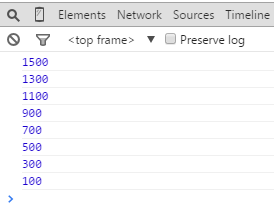
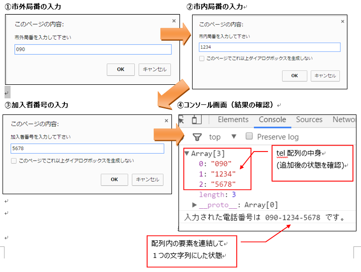
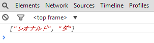
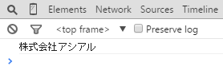
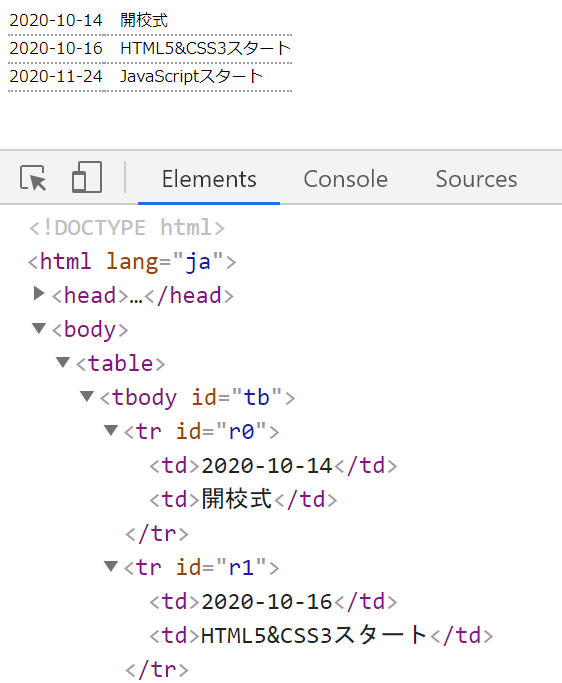

## JavaScript 課題演習６-１

**組み込みオブジェクト(Dateオブジェクト)課題演習**
- 現在の時刻を実行例のようにコンソール画面に表示させてください。<br>
（Dateオブジェクトが持っているgetHoursメソッド、getMinutesメソッド、getSecondsメソッドを使用）
- 時間帯に応じて、朝、昼、夕方、夜、深夜のいずれかのメッセージを表示させるようにしてください。
- ファイル名はpractice6-1.html

時間帯の一覧


|時間帯|条件|
|:---:|---|
|朝|6時から9時まで|
|昼|10時から14時まで|
|夕|15時から17時まで|
|夜|18時から23時まで|
|深夜|0時から5時まで|


**実行結果の例**<br>


<details>
<summary>ヒントを見る</summary>
まずはnew Date()を使用して、日付のオブジェクト(Dateオブジェクト)を作成します。<br>
作成したDateオブジェクトに対してgetHours・getMinutes・getSecondsメソッドを使用して切り分けていきます。

使用例
```js
//timeというオブジェクトを用意する
const time = new Date();

//Dateオブジェクトが持つメソッドを使用
time.～～～～～;
```
切り取った時間、分、秒を繋げてコンソールに出します。
時間だけは更に判定を行い、今の時間帯を出します。
</details>

## JavaScript 課題演習６-２

**組み込みオブジェクト（Mathオブジェクト）操作の課題演習**
- Mathオブジェクトが持っている四捨五入をすることができるメソッドを用いて、計算結果を四捨五入させて下さい。
- ファイル名はpractice6-2.html

```html
   <script>
	//三角形の面積を求める計算式(結果は7.5になります)
	let result = 　5 * 3 / 2;		　　　　　　　  
    //変数resultに格納されている数値を四捨五入して、実行結果と同じ表示にして下さい

   </script>
```

**実行結果の例**<br>


<details>
<summary>ヒントを見る</summary>
Mathオブジェクトが持つメソッドは以下のものがあります。

floor()・・・小数点以下の値を切り捨てる<br>
ceil()・・・小数点以下の値を切り上げる<br>
round()・・・小数点以下の値を四捨五入する

書式例：
Math.メソッド名(変換したいデータ);

</details>

## JavaScript 課題演習６-３

**組み込みオブジェクト（Arrayオブジェクト）の課題演習**
- 配列 <mark>let numbers = [100,300,500,700];</mark> があります。<br>
上記の配列と1～3の機能を実装し、実行結果と同じになるようにしてください。

1. 配列の末尾に要素（900、1100、1300、1500）をArrayオブジェクトが持つ○○メソッドを使用して追加してください。
2. 追加した後、配列の要素を逆順に入れ替えるメソッドを使用し、要素を逆順にしてください。
3. 要素を逆順した後、繰り返し文を使って配列の要素を全て出力するようにしてください。<br>結果はコンソール画面に出力してください。
- ファイル名：practice6-3.html

**実行結果の例**<br>


<details>
<summary>ヒントを見る</summary>

1. 配列のデータを追加するpush()メソッドと並び順を逆にするreverseメソッド()を使います。

2. 問題文の1,2までの機能を実装するとnumbers配列の中は以下のようになっているはずです。<br>
[1500,1300,1100,900,700,500,300,100]<br>
※気になる人はコンソールに出してみてください。

3. 最後は繰り返し文を活用して要素を１つずつ取り出してコンソールに出力します。

</details>

## JavaScript 課題演習６-４

**組み込みオブジェクト（Arrayオブジェクト）の課題演習**
- 空の配列 <mark>let tel = [ ];</mark> があります。
- 上記の配列と1～3の機能を実装し、実行結果と同じになるようにしてください。
1. promptを3回実行させるようにしてください。<br>
	・1回目のプロンプト画面には『市外局番』<br>
	・2回目のプロンプト画面には『市内局番』<br>
	・3回目のプロンプト画面には『加入者番号』を入力させます。

2. 1のプロンプト画面上で入力した３つのデータを空の配列telに追加するようにしてください。<br>
※Arrayオブジェクトが持つメソッドで配列に要素を追加させる方法or使わない方法のどちらでも構いません。<br>
この段階でtel配列の中には３つの要素が入ることになります。<br>
市外局番を090　市内局番を1234  加入者番号5678とした場合<br>
追加後の配列telの状態　⇒ [“090” , ”1234”, “5678”] 

3. 『配列内の要素を連結して一つの文字列を生成するメソッド』を用いて-(ハイフン)が付いた状態の電話番号データを作成してください。
- ハイフン付きの電話番号をコンソール画面に出力して下さい。
- 合わせて配列telに３つのデータが追加されているか確認するために配列変数telの中身もコンソール画面に出力してください。<br>
（正規表現のパターンマッチングは考慮しなくてもよいです。）
- ファイル名：practice6-4.html


**実行結果の例**<br>


<details>
<summary>ヒントを見る</summary>

1. prompt()を３つ用意する市外局番、市内局番、加入者番号のそれぞれの入力画面を用意できます。

2. 空の配列に格納する方法は色々あります。<br>

```js
配列名.push(追加する要素)
```
※↑()の中に変数を埋め込むこともできます。<br>
配列を使わない場合は、各番号を１つずつ変数に格納させていってください。

3. -(ハイフン)を使って配列の要素を結合させます。最終的に１つの文字列として出来上がります。<br>
配列にした場合…joinメソッドが便利です。<br>
配列にしてない場合…+演算子orテンプレート文字列でくっつけてください。

</details>

## JavaScript 課題演習６-５

**組み込みオブジェクト（Stringオブジェクト）の課題演習**
- 文字列 レオナルド・ダ・ヴィンチ があります。・を区切り文字として文字列を分割し、配列に格納するメソッドを使用し、以下の実行結果の表示と同じになるようにしてください。<br>
(コンソール画面に出力してください。）<br>
※引数の設定方法を工夫します。<br>
- ファイル名：practice6-5.html


**実行結果の例**<br>


<details>
<summary>ヒントを見る</summary>

```js
変数名.split( '区切り文字' , 配列の最大要素数);
```
配列の最大要素数は数字が入ります。

```js
//例：
let str = '076-123-4568';
str = str.split('-', 1);
console.log(str); //⇒ ["076"]
//配列の最大要素数1が指定されたので、「076」「123」「4568」の３分割を行った後1つ目の要素だけ表示された
```

</details>

## JavaScript 課題演習６-６

**組み込みオブジェクト（Stringオブジェクト）の課題演習**
- 文字列　"アシアル株式会社"　があります。<br>
この文字列を　"株式会社アシアル"　となるようにStringオブジェクトが持つメソッドを使用して、プログラムを作成してください。<br>
(簡単に言うと株式会社とアシアルを入れ替えます)<br>
- 結果はコンソール画面に出力してください。
- ファイル名：practice6-6.html


**実行結果の例**<br>


<details>
<summary>ヒントを見る</summary>

1. indexOf関数とslice関数を使って『アシアル』を抜き出します。<br>
（アシアルの文字を変数に入れておきます）

2. slice関数を使って『株式会社』を抜き出して変数に入れておきます。

3. 1,2で用意した文字列を連結して結果をコンソール画面に表示させます。

各関数の使い方（変数campanyに"アシアル株式会社"が入っている前提）
```js
//indexOf関数（探したい文字が有る先頭のインデックス番号を取得）
company.indexOf(探したい文字)

//slice関数（位置を指定して文字を切り出す）
company.slice(開始インデックス番号, 終了インデックス番号);
//※終了インデックス番号は最後まで切り取るなら省略可
```

</details>

## JavaScript 課題演習６-７

**連想配列＋繰り返し文の制御に関する課題演習**
- table要素の中のtbody要素に出力するプログラムを作成してください。<br>
用意されているCSS、HTML、オブジェクトを使って実行結果のように、ブラウザ上に表示されるようプログラムを組んでください。<br>
tbody要素の中に3行2列のセルとオブジェクトのデータ（計6つ）をそれぞれ追加してください。
- ファイル名は、practice6-7.html

HTML要素に子要素を追加するときはinsertAdjacentHTML()メソッドを使います。<br>
詳しいメソッドの使い方はテキストP.136またはヒントを参照。
```js
//書式：
document.getElementById('id名').insertAdjacentHTML('どこに','なにを');
```

CSS
```css
table,
tr,
td {
    border-bottom: 2px dotted #9c9c9c;
    border-collapse: collapse;
}
td:nth-of-type(2) {
    padding-left: 1rem;
}

```
HTML
```HTML
<table>
    <tbody id="tb"></tbody>
</table>
```

オブジェクト(javascript)
```js
const data = {
    r0: ['2020-10-14', '開校式'],
    r1: ['2020-10-16', 'HTML5&CSS3スタート'],
    r2: ['2020-11-24', 'JavaScriptスタート'],
}
```

**実行結果の例**<br>


<details>
<summary>ヒントを見る</summary>

- insertAdjacentHTML ()メソッドは取得した要素の前後、または子要素として別の要素を挿入します。

一つ目の引数 'どこに' にはキーワードをセットします。

キーワードは4つ 'beforebegin'、 'afterbegin'、 'beforeend'、 'afterend'

二つ目の引数 'なにを' には追加する子要素をセットします。<br>
（必ずHTMLタグの要素を全て記述すること！）


```js
//例：
const li = `<li>${item}</li>`;
document.getElementById('list').insertAdjacentHTML('beforeend', li);
```

</details>
