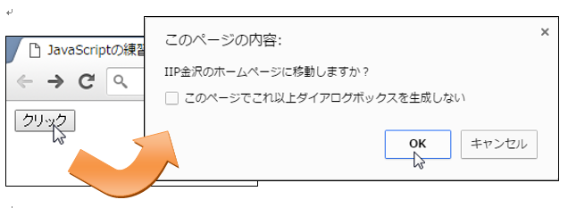
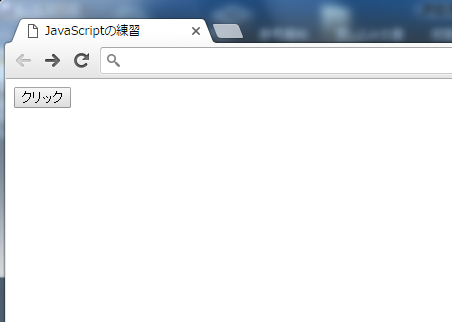
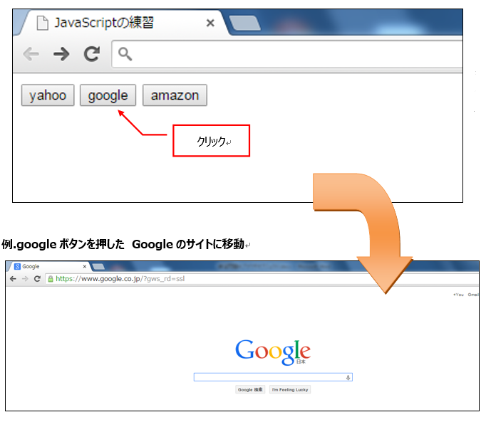
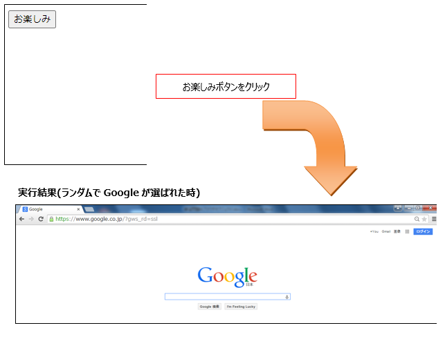
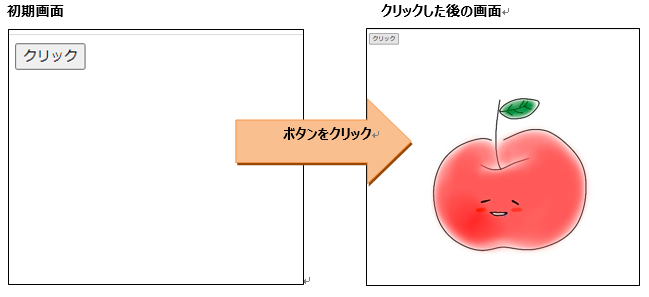
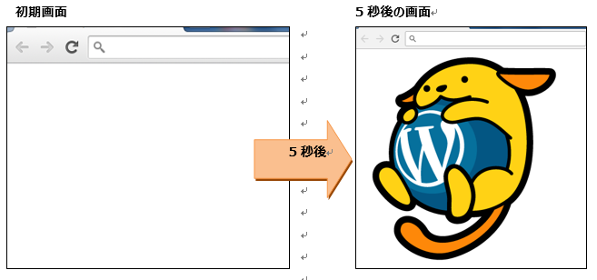
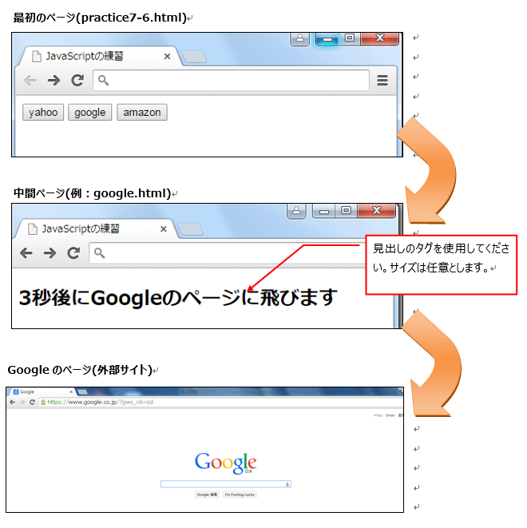
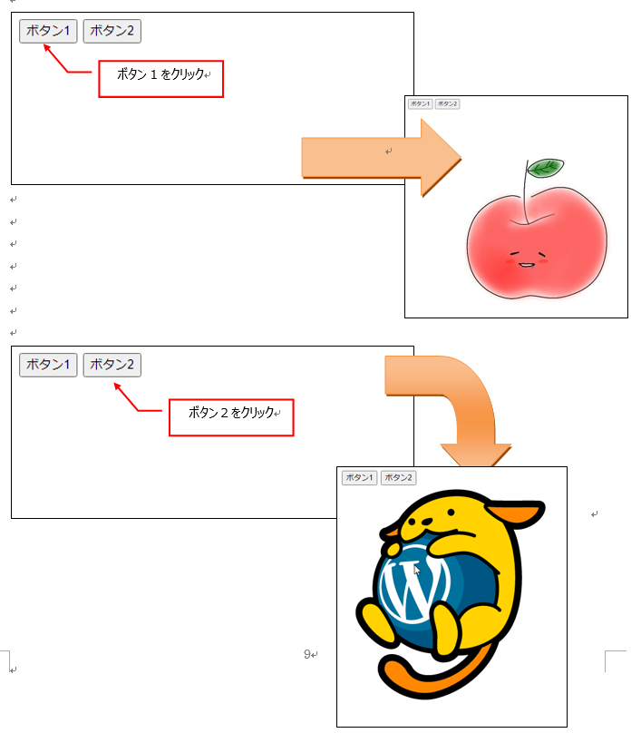
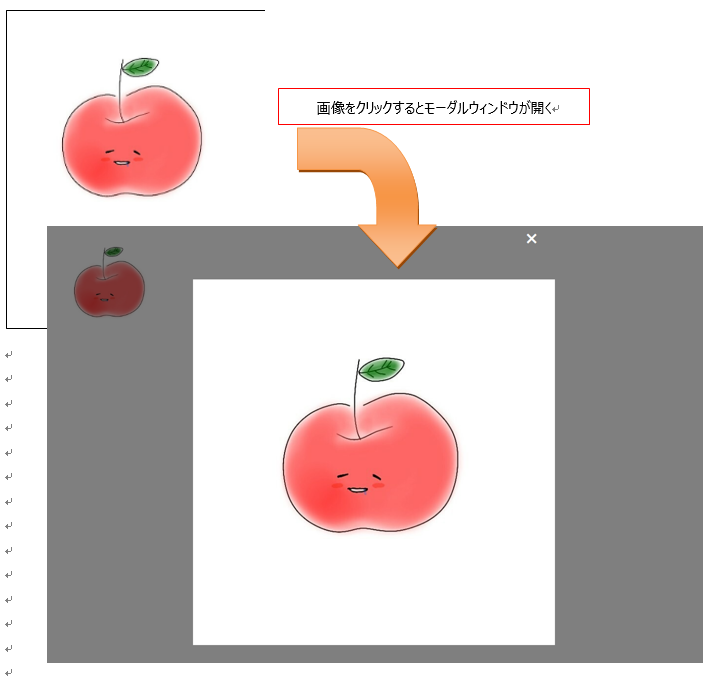

## JavaScript 課題演習７-１

**イベント発生時の処理の課題演習**
- クリックボタンを押すと、確認用のダイアログボックスを表示させるプログラムを作成してください。<br>
「OKボタン」を押した時は、IIP金沢のHPに移動するようにしてください。<br>
「キャンセルボタン」を押した時は、ダイアログボックスが閉じるようになればOKです。

```
アイアイピー金沢URL⇒　　https://iip-kanazawa.co.jp/
```

- ファイル名はpractice7-1.html


**実行結果の例**<br>


【OK】をクリックした場合<br>


【キャンセル】をクリックした場合（ダイアログが閉じて終わり）<br>


<details>
<summary>ヒントを見る</summary>

確認ダイアログボックスはconfirm()メソッドを利用。
- confirm()の戻り値はbool型（true または falseしか出ない）
- trueが戻ってきたときにHPに移動するようにプログラムを書きましょう。

今回はイベント発生を検知→処理の順になります。<br>
1. ボタンをクリックしたら検知
2. confirm()メソッドでダイアログを表示
3. OKが押されたら（trueが返ってきたら）ページ移動

location.hrefプロパティは、現在のページのURLを取得、または指定したURLへ移動させたいときに使います。

```js
//外部サイトの場合
location.href = 'http://〇〇〇~';

//同じフォルダ上の別ページに移動
location.href = './△△.html';
```

イベントの説明はP.156～、ボタンをクリックしたときのイベントはP.216~
が参考になります。

</details>

## JavaScript 課題演習７-２

**イベント発生時の処理の課題演習**
- 各ボタンを押すとボタン名に表示されているサイトに移動するプログラムを作成してください。<br>
yahoo⇒  http://www.yahoo.co.jp<br>
google⇒ http://www.google.co.jp<br>
amazon⇒ http://www.amazon.co.jp<br>
- ファイル名はpractice7-2.html


外部ファイル（外部サイト）へ移動するにはwindowオブジェクトのopen()メソッドでもOKです。<br>
書式：window.open('外部ファイル（外部サイト）のパス', 'オプション') 


**実行結果の例**<br>


<details>
<summary>ヒントを見る</summary>
各ボタンごとにイベントが発生するので、検知して処理すればいいです。<br>

外部サイトの移動をブラウザの別タブで開くようにするにはlocation.hrefプロパティではなくwindow.open()メソッドを使うとよいです。

例：window.open('http://〇〇〇~', '_blank')

※別タブで開くか別ウィンドウで開くかはブラウザ（または設定）によって違うので注意が必要です。

</details>

## JavaScript 課題演習７-３

**イベント発生時の処理の課題演習**<br>
以下のようなWeb画面を作成してください。
- 「お楽しみ」ボタンを押した時、yahoo、google、amazonの中から１つランダムで選ばれたWebサイトを表示できるようにしてください。
- ファイル名はpractice7-3.html

ランダムの意味：無作為(偶然)という意味。

※ランダムの仕組みは、Math.floor(Math.random() * 3)を利用してください。<br>
Mathオブジェクトが持つrandom()メソッドを利用して今回は０～２までの数字がランダムで１つ出ます。<br>
プログラムを実行するたびに、出てくる数値が変わります。


**実行結果の例**<br>


<details>
<summary>ヒントを見る</summary>
一つ前のプログラムの発展版になります。<br>
『お楽しみ』ボタンはランダム機能を追加して作成します。

ランダムで生成された数値を条件分岐で分岐させます。

```js
//変数aの中には0～2のどれかが入ります。
const　a = Math.floor(Math.random() * 3);

//例if文で条件分岐を行う
if( a === 0){
	aが0だったときの処理
}else if(a === 1){
	aが1だったときの処理
}else if(a === 2){
	aが2だったときの処理
}
```

※同じ値を評価していく場合はswitch文にした方がスッキリします。
試してみてください。（テキストP.209）

</details>

## JavaScript 課題演習７-４

**動的Webアプリケーション作成(DOM操作)の課題演習**
- ボタンをクリックしたら画像を表示させるプログラムを作成してください。※使用する画像は任意とします。
- ファイル名はpractice7-4.html


**実行結果の例**<br>


<details>
<summary>ヒントを見る</summary>
画像を表示させるプログラムは以下の要素の中に挿入できるプログラムでimgタグを埋め込みます。<br>
ボタンをクリックしたタイミングで既存の要素に画像の要素を子要素として埋め込めばよいです。

insertAdjacentHTML()メソッドは既存の子要素はそのままでどんどん追加されます。
```js
//例：
document.要素選択().insertAdjacentHTML('キーワード', "");
```
<br>
innerHTMLプロパティは既存の子要素を上書きする形になるので常に代入した値しか存在しない状態になる。

```js
//例：
document.要素選択().innerHTML = "";
```


</details>

## JavaScript 課題演習７-５

**動的Webアプリケーション作成(DOM操作)の課題演習**
- ブラウザを開いてから5秒後に画像を表示させるプログラムを作成してください。　
※使用する画像は任意とします。
- ファイル名はpractice7-5.html


**実行結果の例**<br>


<details>
<summary>ヒントを見る</summary>

setTimeout()メソッドとfunctionを組み合わせて使います。<br>
時間をカウントアップさせる仕組みをsetTimeoutで作成し、5秒(5000ミリ秒)になった時に、画像を表示させる命令を実行させます。<br>
書き方等はテキストP.190～を参照。

</details>

## JavaScript 課題演習７-６

**動的Webアプリケーション作成(DOM操作)の課題演習**
- 各ボタンを押した際、中間ページに移動し3秒後に外部Webサイトへ移動するプログラムを作成してください。
- ファイル名は<br>
最初のページ：practice7-6.html<br>
中間ページ(yahoo.html、google.html、amazon.html) <br>
にしてください。


**実行結果の例**<br>


<details>
<summary>ヒントを見る</summary>

各ボタンを押した時、location.hrefを利用して、各中間ページに移動させるようにします。
(window.open()でもよいです。)
<br>
例.yahooボタンを押した時<br>
practice7-6.html ⇒yahoo.html（3秒間待機させる） ⇒yahooのサイト に移動

例.googleボタンを押した時<br>
practice7-6.html ⇒google.html（3秒間待機させる） ⇒googleのサイト に移動

例.amazonボタンを押した時<br>
practice7-6.html ⇒amazon.html（3秒間待機させる） ⇒amazonのサイト に移動

</details>

## JavaScript 課題演習７-７

**動的Webアプリケーション作成(DOM操作)の課題演習**
- ボタンをクリックしたら画像を表示させるプログラムを作成してください。
※practice７-４を拡張させたものになります。<br>
※使用する画像は任意とします。<br>
- ファイル名はpractice7-7.html

仕様について
- ボタン1とボタン2を押すと異なる画像が表示される。<br>
（既に表示されていれば切り替わって画像が表示）
- ボタン要素にはid属性は設定せず、name属性とvalue属性だけ設定する。


**実行結果の例**<br>


<details>
<summary>ヒントを見る</summary>
- 画像を表示させるプログラムはpractice7-４のヒントを参考にしてください。

ボタン要素にはname属性とvalue属性を設定する。
```html
<button name='btn' value='btn1'>ボタン1</button>
<button name='btn' value='btn2'>ボタン2</button>
```
要素へのアクセスはdocument.getElementById「以外」で行う。（そもそもIDがない）

※テキストにある【セレクタを取得する方法】が分かり易いと思うが、【指定したname属性をすべて取得するメソッド】もあるので、検索してみよう。<br>
（複数要素を取得する場合はforEach()で処理する必要があります）<br>
テキストP.205~orP226~を参照
</details>

## JavaScript 課題演習７-８

**動的Webアプリケーション作成(DOM操作)の課題演習**
- 画像をクリックしたら※モーダルウィンドウを表示させるプログラムを作成してください。<br>
※画像をクリックすると画面いっぱいに画像が出てくれる機能のこと

細かい仕様は以下の通りです。
- 画像を押すとモーダルウィンドウが表示される。
- 表示されたモーダルウィンドウのどこかをクリックするとモーダルウィンドウが閉じる。

HTMLとCSSは以下を使用してください。
画像を自分で用意した場合はHTML内の「apple.jpg」のファイル名を変更してください。

HTML
```html
<body>
    
    <div class="modal-w">
        <div class="modal-close">×</div>
        <div class="modal-n">
        </div>
    </div>
</body>
```

CSS
```css
body {
    margin: 0;
    position: relative;
}

img {
    width: 20%;
}

.modal-n img {
    width: 100%;
}

.modal-w {
    width: 100vw;
    height: 100vh;
    background-color: rgba(0, 0, 0, 0.5);
    position: absolute;
    top: 0;
    left: 0;
    display: none;
}

.modal-close {
    width: 50%;
    margin: 0 auto;
    font-size: 2rem;
    font-weight: 600;
    color: rgb(255, 255, 255); 
    padding: 0.5rem;
    text-align: right;
}

.modal-n {
    width: 50%;
    background-color: rgb(255, 255, 255);
    margin: 0 auto;
    padding: 2rem;
    position: absolute;
    top: 53%;
    left: 50%;
    transform: translate(-50%, -50%);
}

.d_block {
    display: block;
}
```

**実行結果の例**<br>


<details>
<summary>ヒントを見る</summary>

画像を表示させるプログラムはpractice7-４のヒントを参考にしてください。<br>

今回のアクセスする要素は画像です。
```html
;
```

画像をクリックしたタイミングで<br>
⓵用意されたモーダルウィンドウ内に画像の要素を挿入<br>
⓶非表示にしていた要素を表示する<br>
が行われれば良いです。

モーダルがCSSのどの部分によって非表示になっているか、どの部分に画像が入ると良いかをまずは考えてみましょう。

Class属性にClass名を追加したり削除したりすると、CSSが適用されたり外れたりするので動的にスタイルを変えることができます。

```js
//body要素にbg-cというクラスを追加
document.querySelector('body').classList.add('bg-c');

//body要素からbg-cというクラスを削除
document.querySelector('body').classList.remove('bg-c');
```
</details>
